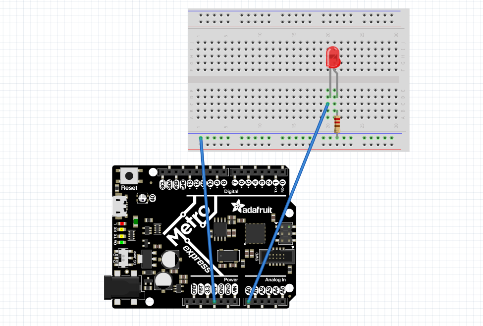

# CircuitPython
My CircuitPython assignments

### Assignment 1: Led Fade

 Click Here for Info: 

 
  
Code file name:LED Fade(CurcuitPython).py

Purpose:Make a LED fade in and out.

Tips & Tricks

This assignment was the first of the year and very much so an introduction to CircuitPython. The objective of the assignment was to make an LED fade in, and out of brightness. The wiring is very simple, and I have no particular tips, because it's such a simple circuit. As far as the code is concerned, using  a bool function is important here because it makes things much easier. Using a bool function, or a true-false statement gives two options true, or false.With these two options you should see them as an up or down, in place of true or false. Up(true) being the code you write for the LED fading in, and down(false) is the code you write for the LED fading out.

Pictures:

### Assignment 2: Servo

 Click Here for Info: 

 

Code file name:Capacitive Touch and servo(CurcuitPython).py

Purpose:Use captive touch to control a servo.

Tips & Tricks
Captive touch might seem like this new technology that you’ve never seen before, but in reality captive touch is just a button that you can’t see. Using wire as a button is just as simple as coding a wire button, which is almost identical to wiring a button. 

Pictures:

### Assignment 3: LCD and Button

 Click Here for Info: 

 

Code file: name:LCD and button(CurcuitPython).py

Purpose:Use a button to control an lcd to count up or down.

Tips & Tricks: This is one of the harder assignments then the others. It will be one of the first obstacles that you run into will be errors, and a lot of them. The first error most people came into contact with was having and updated metro, this issue was a big obstacle, because of just pure technical errors, however, the problem is mostly fixed, so whoever is reading this should not have this problem. The second error was the error about spacing(you'll know it when you see it) just add a space and you should be good to go(look at the bottom of the code). Other than those two errors it should be fairly straight forward but dont be discouraged if it dosent the first 10 20 or even 30 times eventully with enough googling you will get it. 

Pictures:

### Assignment 4 photo interrupter 

 Click Here for Info: 

 

Code file:

Purpose: Use an lcd and a photo interrupter so that every 4 seconds the photo interrupter would tell the lcd how many times it has been interrupted. 

Tips & Tricks: This assignment was fairly easy and not nearly as hard as the previous one, the code for the lcd has already been done in the previous assignment, so half the work is already done. The only thing that needs to be done is the photo interrupter. The main new thing you will learn in this assignment is time. Time could be represented in multiple ways but first you will need to import time and in my case I used "monotonic"(monotonic is a piece of code used for time google it and you will know what I mean) to  tell the metro do something every 4 seconds. Then it prints out the number(named number) that associates with the photo interrupter interruptions.

Pictures:

### Assignment 5 neopixel and sonar 

 Click Here for Info: 

 

Code file name:

Purpose:In this assignment I used a sonar to detect distance and a neopixel that shows a color depending on how far away it is from the nearest object.

Tips & Tricks:This is a fairly easy assignment if you DON’T HARD CODE IT. I know it may be tempting to hard code it for each individual color but one that would take about 3 years assuming you didn't sleep drink eat or tire. Use equations such as the ones listed below; I know these might look really confusing at first but all these are just like any equation you would use in math. If you use this site called Desmos(graphing calculator) you can see why these equations are so important(use my code as refrence).

r =(-((sonar.distance)*8)+127)
b =(((sonar.distance)*8)-127) 
g =-(abs(((sonar.distance)*8)-127))+100

Pictures:

### Assignment 6 Classes, Modules, and Objects.

 Click Here for Info: 

 
  
Code file name:LED Fade(CurcuitPython).py 

Purpose: In this assignment I used 2 rgb leds to make a (out of order) rainbow. I was given the code below and told to make a library that made it possible.

Tips & Tricks: This assignment was one of the hardest this year, so if you are reading this budget your time . This assignment introduces many things: libraries, modules, and coding rgb leds. The use of self. is a bit of code you will use for most lines of code in this assignment(reference the library) the reasoning for this is because your mainly defining modules. Understanding the coding of modules will save your life. Coding the rgb leds are fairly simple when compared to coding modules(in my opinion) the thing you will need for defining colors are as follow

### Assignment 7: Hello Vs code

 Click Here for Info: 

 
  
Code file name:LED Fade(CurcuitPython).py

Purpose: create a folder in vs code and make a hello in serial monitior 

Tips & Tricks
Just follow the directions its fairly simple. Its very simmilar to the first assignment of the yaer its just to get your foot in the ground when it comes to a new programming language.

Pictures:

### Assignment 8: Fancy LED

 Click Here for Info: 

 
  
Purpose: use vs code to make 6 leds light up in various orders

Code file name:

Tips & Tricks
This assignment is the first to get you into VS code witch is just python instead of circuit python. It involes simmilar aspects from assignment 6 but instead of controling two leds doing the same function you are contrliing 6 leds with 3-4 diffrent functions. The acctual code is only difficult if you never did classes and modules. This one 

Pictures:

| Tables        | Are           | how you should budget time  |
| ------------- |:-------------:| -----:|
| col 3 is      | right-aligned | $1600 |
| col 2 is      | centered      |   $12 |
| zebra stripes | are neat      |    $1 |

